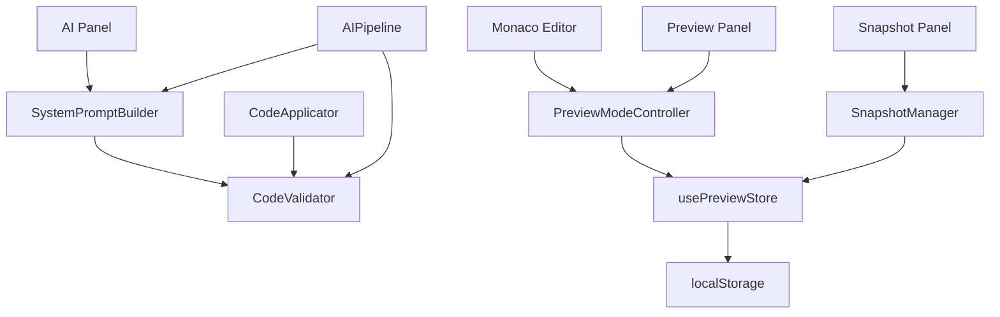

# YYC3 IDE 系统架构文档

> **版本**: v1.1.0  
> **更新日期**: 2026-03-31  
> **作者**: YanYuCloudCube Team  
> **状态**: 已完成

---

## 📋 目录

- [架构概览](#架构概览)
- [核心模块架构](#核心模块架构)
- [数据流架构](#数据流架构)
- [依赖关系图](#依赖关系图)
- [性能优化架构](#性能优化架构)
- [扩展性设计](#扩展性设计)

---

## 架构概览

### 系统架构图

```
┌─────────────────────────────────────────────────────────────────┐
│                        YYC3 IDE 系统                              │
├─────────────────────────────────────────────────────────────────┤
│                                                                   │
│  ┌──────────────────────────────────────────────────────────┐   │
│  │                      用户界面层 (UI Layer)                 │   │
│  │  ┌─────────┐  ┌─────────┐  ┌─────────┐  ┌─────────┐     │   │
│  │  │ 编辑器  │  │  预览   │  │ AI面板  │  │ 设置    │     │   │
│  │  │ Monaco  │  │ Preview │  │ AI Panel│  │ Settings│     │   │
│  │  └────┬────┘  └────┬────┘  └────┬────┘  └────┬────┘     │   │
│  └───────┼────────────┼────────────┼────────────┼───────────┘   │
│          │            │            │            │               │
│  ┌───────┼────────────┼────────────┼────────────┼───────────┐   │
│  │       │    业务逻辑层 (Business Logic Layer)   │           │   │
│  │  ┌────▼────────────▼────────────▼────────────▼────┐      │   │
│  │  │  PreviewModeController (预览模式控制器)         │      │   │
│  │  └────────────────────────────────────────────────┘      │   │
│  │  ┌─────────────────────────────────────────────────┐     │   │
│  │  │  SnapshotManager (快照管理器)                    │     │   │
│  │  └─────────────────────────────────────────────────┘     │   │
│  │  ┌─────────────────────────────────────────────────┐     │   │
│  │  │  CodeValidator (代码验证器)                      │     │   │
│  │  └─────────────────────────────────────────────────┘     │   │
│  │  ┌─────────────────────────────────────────────────┐     │   │
│  │  │  SystemPromptBuilder (系统提示词构建器)          │     │   │
│  │  └─────────────────────────────────────────────────┘     │   │
│  └───────┬────────────┬────────────┬────────────┬───────────┘   │
│          │            │            │            │               │
│  ┌───────┼────────────┼────────────┼────────────┼───────────┐   │
│  │       │    数据存储层 (Data Storage Layer)    │           │   │
│  │  ┌────▼────────────▼────────────▼────────────▼────┐      │   │
│  │  │  Zustand Store (状态管理)                       │      │   │
│  │  └────────────────────────────────────────────────┘      │   │
│  │  ┌─────────────────────────────────────────────────┐     │   │
│  │  │  localStorage (持久化存储)                       │     │   │
│  │  └─────────────────────────────────────────────────┘     │   │
│  │  ┌─────────────────────────────────────────────────┐     │   │
│  │  │  IndexedDB (大容量存储)                          │     │   │
│  │  └─────────────────────────────────────────────────┘     │   │
│  └──────────────────────────────────────────────────────────┘   │
│                                                                   │
└─────────────────────────────────────────────────────────────────┘
```

### 架构分层说明

| 层级 | 职责 | 组件 |
|------|------|------|
| **UI 层** | 用户交互、界面渲染 | Monaco 编辑器、预览面板、AI 面板、设置页面 |
| **业务逻辑层** | 核心功能实现 | 预览模式控制器、快照管理器、代码验证器、提示词构建器 |
| **数据存储层** | 数据持久化、状态管理 | Zustand Store、localStorage、IndexedDB |

---

## 核心模块架构

### 1. PreviewModeController (预览模式控制器)

**职责**: 管理 IDE 预览的三种模式，控制预览更新时机

**架构图**:

```
┌─────────────────────────────────────────────────────┐
│        PreviewModeController (预览模式控制器)        │
├─────────────────────────────────────────────────────┤
│                                                     │
│  ┌──────────────────────────────────────────────┐  │
│  │  模式管理 (Mode Management)                   │  │
│  │  - realtime (实时模式)                        │  │
│  │  - manual (手动模式)                          │  │
│  │  - delayed (延迟模式)                         │  │
│  └──────────────────────────────────────────────┘  │
│                                                     │
│  ┌──────────────────────────────────────────────┐  │
│  │  更新控制 (Update Control)                    │  │
│  │  - 节流控制 (Throttle: 100ms)                 │  │
│  │  - 防抖控制 (Debounce: 500ms)                 │  │
│  │  - 手动触发 (Manual Trigger)                  │  │
│  └──────────────────────────────────────────────┘  │
│                                                     │
│  ┌──────────────────────────────────────────────┐  │
│  │  性能优化 (Performance Optimization)          │  │
│  │  - 智能统计 (Smart Stats)                     │  │
│  │  - 批量更新 (Batch Update)                    │  │
│  │  - 内存管理 (Memory Management)               │  │
│  └──────────────────────────────────────────────┘  │
│                                                     │
└─────────────────────────────────────────────────────┘
```

**关键特性**:
- ✅ 三种预览模式动态切换
- ✅ 节流/防抖优化机制
- ✅ 智能统计编辑频率
- ✅ 批量更新队列管理
- ✅ 定时器自动清理

**依赖关系**:
- 依赖: `usePreviewStore` (Zustand Store)
- 被依赖: `MonacoWrapper`, `PreviewPanel`

---

### 2. SnapshotManager (快照管理器)

**职责**: 管理代码快照的创建、存储、恢复和比较

**架构图**:

```
┌─────────────────────────────────────────────────────┐
│          SnapshotManager (快照管理器)                │
├─────────────────────────────────────────────────────┤
│                                                     │
│  ┌──────────────────────────────────────────────┐  │
│  │  快照创建 (Snapshot Creation)                 │  │
│  │  - 文件收集 (File Collection)                 │  │
│  │  - 哈希计算 (Hash Calculation)                │  │
│  │  - 元数据生成 (Metadata Generation)           │  │
│  └──────────────────────────────────────────────┘  │
│                                                     │
│  ┌──────────────────────────────────────────────┐  │
│  │  存储管理 (Storage Management)                │  │
│  │  - 压缩算法 (Compression: LZ)                 │  │
│  │  - 增量存储 (Incremental Storage)             │  │
│  │  - 容量控制 (Capacity Control: 5MB)           │  │
│  │  - 智能清理 (Smart Cleanup)                   │  │
│  └──────────────────────────────────────────────┘  │
│                                                     │
│  ┌──────────────────────────────────────────────┐  │
│  │  快照操作 (Snapshot Operations)               │  │
│  │  - 恢复快照 (Restore)                         │  │
│  │  - 删除快照 (Delete)                          │  │
│  │  - 比较快照 (Compare)                         │  │
│  │  - 列出快照 (List)                            │  │
│  └──────────────────────────────────────────────┘  │
│                                                     │
└─────────────────────────────────────────────────────┘
```

**关键特性**:
- ✅ 快照自动压缩（阈值 10KB）
- ✅ 增量存储优化
- ✅ localStorage 容量控制
- ✅ 智能清理旧快照
- ✅ 快照差异比较

**依赖关系**:
- 依赖: `localStorage`, `usePreviewStore`
- 被依赖: `SnapshotPanel`, `usePreviewStore`

---

### 3. CodeValidator (代码验证器)

**职责**: 验证 AI 生成的代码质量和安全性

**架构图**:

```
┌─────────────────────────────────────────────────────┐
│           CodeValidator (代码验证器)                 │
├─────────────────────────────────────────────────────┤
│                                                     │
│  ┌──────────────────────────────────────────────┐  │
│  │  验证规则 (Validation Rules)                  │  │
│  │  - 语法检查 (Syntax Check)                    │  │
│  │  - 安全检查 (Security Check)                  │  │
│  │  - 最佳实践 (Best Practices)                  │  │
│  │  - 复杂度分析 (Complexity Analysis)           │  │
│  └──────────────────────────────────────────────┘  │
│                                                     │
│  ┌──────────────────────────────────────────────┐  │
│  │  性能优化 (Performance Optimization)          │  │
│  │  - 正则缓存 (Regex Cache)                     │  │
│  │  - 结果缓存 (Result Cache)                    │  │
│  │  - 并行验证 (Parallel Validation)             │  │
│  │  - 增量验证 (Incremental Validation)          │  │
│  └──────────────────────────────────────────────┘  │
│                                                     │
│  ┌──────────────────────────────────────────────┐  │
│  │  验证输出 (Validation Output)                 │  │
│  │  - 验证结果 (Validation Result)               │  │
│  │  - 错误列表 (Errors)                          │  │
│  │  - 警告列表 (Warnings)                        │  │
│  │  - 建议列表 (Suggestions)                     │  │
│  │  - 性能指标 (Metrics)                         │  │
│  └──────────────────────────────────────────────┘  │
│                                                     │
└─────────────────────────────────────────────────────┘
```

**关键特性**:
- ✅ 正则表达式缓存
- ✅ 验证结果缓存
- ✅ 并行验证多文件
- ✅ 增量验证优化
- ✅ 性能统计监控

**依赖关系**:
- 依赖: `CodeApplicator`, `AIPipeline`
- 被依赖: `AIPipeline`, `CodeApplicator`

---

### 4. SystemPromptBuilder (系统提示词构建器)

**职责**: 构建上下文感知的 AI 系统提示词

**架构图**:

```
┌─────────────────────────────────────────────────────┐
│       SystemPromptBuilder (系统提示词构建器)          │
├─────────────────────────────────────────────────────┤
│                                                     │
│  ┌──────────────────────────────────────────────┐  │
│  │  意图检测 (Intent Detection)                  │  │
│  │  - generate (生成代码)                        │  │
│  │  - modify (修改代码)                          │  │
│  │  - fix (修复代码)                             │  │
│  │  - explain (解释代码)                         │  │
│  │  - refactor (重构代码)                        │  │
│  │  - test (生成测试)                            │  │
│  │  - review (代码审查)                          │  │
│  └──────────────────────────────────────────────┘  │
│                                                     │
│  ┌──────────────────────────────────────────────┐  │
│  │  上下文构建 (Context Building)                │  │
│  │  - 项目上下文 (Project Context)               │  │
│  │  - 文件上下文 (File Context)                  │  │
│  │  - 用户偏好 (User Preferences)                │  │
│  │  - 历史记录 (History)                         │  │
│  └──────────────────────────────────────────────┘  │
│                                                     │
│  ┌──────────────────────────────────────────────┐  │
│  │  性能优化 (Performance Optimization)          │  │
│  │  - Token 估算 (Token Estimation)              │  │
│  │  - 上下文压缩 (Context Compression)           │  │
│  │  - 缓存机制 (Caching)                         │  │
│  │  - 增量构建 (Incremental Build)               │  │
│  └──────────────────────────────────────────────┘  │
│                                                     │
└─────────────────────────────────────────────────────┘
```

**关键特性**:
- ✅ 智能意图检测
- ✅ Token 精确估算
- ✅ 上下文智能压缩
- ✅ 三级缓存机制
- ✅ 增量构建优化

**依赖关系**:
- 依赖: `ContextCollector`, `AIPipeline`
- 被依赖: `AIPipeline`, `AIProvider`

---

## 数据流架构

### 完整工作流数据流图

```
┌─────────────────────────────────────────────────────────────────┐
│                        完整工作流数据流                           │
└─────────────────────────────────────────────────────────────────┘

用户输入
   │
   ├─────────────────────┬──────────────────────┐
   │                     │                      │
   ▼                     ▼                      ▼
编辑代码              AI 请求              手动操作
   │                     │                      │
   ▼                     ▼                      ▼
┌──────────┐      ┌──────────────┐      ┌──────────┐
│Monaco    │      │意图检测      │      │用户触发  │
│Editor    │      │(Intent)      │      │          │
└────┬─────┘      └──────┬───────┘      └────┬─────┘
     │                   │                   │
     ▼                   ▼                   ▼
┌──────────┐      ┌──────────────┐      ┌──────────┐
│PreviewMode│      │PromptBuilder │      │Snapshot  │
│Controller│      │              │      │Manager   │
└────┬─────┘      └──────┬───────┘      └────┬─────┘
     │                   │                   │
     │                   ▼                   │
     │            ┌──────────────┐           │
     │            │AI Provider   │           │
     │            │(API Call)    │           │
     │            └──────┬───────┘           │
     │                   │                   │
     │                   ▼                   │
     │            ┌──────────────┐           │
     │            │CodeValidator │           │
     │            │              │           │
     │            └──────┬───────┘           │
     │                   │                   │
     ▼                   ▼                   ▼
┌────────────────────────────────────────────────────┐
│              Zustand Store (全局状态管理)            │
│  - previewState (预览状态)                         │
│  - snapshotState (快照状态)                        │
│  - validationState (验证状态)                      │
│  - aiState (AI 状态)                               │
└────────────────┬───────────────────────────────────┘
                 │
                 ├─────────────────────┬──────────────────────┐
                 │                     │                      │
                 ▼                     ▼                      ▼
          ┌──────────┐          ┌──────────┐          ┌──────────┐
          │预览面板  │          │编辑器    │          │AI 面板   │
          │Update    │          │Update    │          │Update    │
          └──────────┘          └──────────┘          └──────────┘
                 │                     │                      │
                 └─────────────────────┴──────────────────────┘
                                       │
                                       ▼
                                 localStorage
                                 (持久化存储)
```

---

### 预览更新数据流

```
┌─────────────────────────────────────────────────────────────────┐
│                      预览更新数据流                               │
└─────────────────────────────────────────────────────────────────┘

用户编辑代码
     │
     ▼
┌──────────────────┐
│ Monaco Editor    │
│ onChange Event   │
└────────┬─────────┘
         │
         ▼
┌──────────────────┐
│ notifyFileChange │
└────────┬─────────┘
         │
         ▼
┌──────────────────────────────────┐
│ PreviewModeController            │
│ ┌────────────────────────────┐   │
│ │ 根据模式选择策略:           │   │
│ │ - realtime: 节流 (100ms)   │   │
│ │ - manual: 标记待更新       │   │
│ │ - delayed: 防抖 (500ms)    │   │
│ └────────────────────────────┘   │
└────────┬─────────────────────────┘
         │
         ▼
┌──────────────────┐
│ onTriggerUpdate  │
│ Callback         │
└────────┬─────────┘
         │
         ▼
┌──────────────────┐
│ usePreviewStore  │
│ updatePreview    │
└────────┬─────────┘
         │
         ▼
┌──────────────────┐
│ Preview Panel    │
│ Refresh          │
└──────────────────┘
```

---

### AI 代码生成数据流

```
┌─────────────────────────────────────────────────────────────────┐
│                    AI 代码生成数据流                              │
└─────────────────────────────────────────────────────────────────┘

用户输入描述
     │
     ▼
┌──────────────────┐
│ AI Input Panel   │
└────────┬─────────┘
         │
         ▼
┌──────────────────────────────────┐
│ SystemPromptBuilder              │
│ ┌────────────────────────────┐   │
│ │ 1. 意图检测                 │   │
│ │ 2. 上下文收集               │   │
│ │ 3. Token 估算               │   │
│ │ 4. 上下文压缩               │   │
│ │ 5. 提示词构建               │   │
│ └────────────────────────────┘   │
└────────┬─────────────────────────┘
         │
         ▼
┌──────────────────┐
│ AI Provider      │
│ (API Request)    │
└────────┬─────────┘
         │
         ▼
┌──────────────────────────────────┐
│ CodeValidator                    │
│ ┌────────────────────────────┐   │
│ │ 1. 语法检查                 │   │
│ │ 2. 安全检查                 │   │
│ │ 3. 最佳实践                 │   │
│ │ 4. 复杂度分析               │   │
│ └────────────────────────────┘   │
└────────┬─────────────────────────┘
         │
         ├─────────────┬─────────────┐
         │             │             │
         ▼             ▼             ▼
    验证通过       验证警告       验证失败
         │             │             │
         ▼             ▼             ▼
    应用代码      显示警告      拒绝应用
         │             │             │
         └─────────────┴─────────────┘
                       │
                       ▼
              ┌──────────────────┐
              │ CodeApplicator   │
              │ 应用代码到编辑器  │
              └──────────────────┘
```

---

## 依赖关系图

### 模块依赖关系

```
┌─────────────────────────────────────────────────────────────────┐
│                        模块依赖关系图                             │
└─────────────────────────────────────────────────────────────────┘

UI 层组件:
┌──────────────┐
│ MonacoWrapper│ ──依赖──> PreviewModeController
└──────────────┘              │
                              │
┌──────────────┐              │
│ PreviewPanel │ ──依赖───────┤
└──────────────┘              │
                              │
┌──────────────┐              │
│ SnapshotPanel│ ──依赖───────┼──> SnapshotManager
└──────────────┘              │
                              │
┌──────────────┐              │
│ AI Panel     │ ──依赖───────┼──> SystemPromptBuilder
└──────────────┘              │         │
                              │         │
                              │         ▼
                              │    ┌──────────────┐
                              └───>│CodeValidator │
                                   └──────────────┘

状态管理:
┌──────────────┐
│usePreviewStore│ ──依赖──> PreviewModeController
└──────────────┘              SnapshotManager
                              (状态持久化)
```

---

### 包依赖关系



---

## 性能优化架构

### 缓存架构

```
┌─────────────────────────────────────────────────────────────────┐
│                          缓存架构                                 │
└─────────────────────────────────────────────────────────────────┘

┌──────────────────┐
│ Level 1: 内存缓存 │ (最快)
└────────┬─────────┘
         │
         ├─> PreviewModeController: 智能模式统计
         ├─> CodeValidator: 正则缓存、结果缓存
         ├─> SystemPromptBuilder: 意图缓存、提示词缓存
         └─> SnapshotManager: 文件哈希映射

┌──────────────────┐
│ Level 2: 会话缓存 │ (快)
└────────┬─────────┘
         │
         ├─> Zustand Store: 全局状态
         └─> Session Storage: 临时数据

┌──────────────────┐
│ Level 3: 持久缓存 │ (慢)
└────────┬─────────┘
         │
         ├─> localStorage: 快照、设置
         └─> IndexedDB: 大容量数据
```

---

### 性能监控架构

```
┌─────────────────────────────────────────────────────────────────┐
│                       性能监控架构                                │
└─────────────────────────────────────────────────────────────────┘

┌──────────────────┐      ┌──────────────────┐
│PreviewMode       │      │SnapshotManager   │
│Controller        │      │                  │
│                  │      │                  │
│ - 节流效果       │      │ - 创建时间       │
│ - 防抖效果       │      │ - 压缩率         │
│ - 更新次数       │      │ - 存储大小       │
└────────┬─────────┘      └────────┬─────────┘
         │                         │
         └──────────┬──────────────┘
                    │
         ┌──────────▼──────────┐
         │PerformanceStats     │
         │(性能统计中心)        │
         │                     │
         │ - 总耗时            │
         │ - 缓存命中率        │
         │ - 平均耗时          │
         └──────────┬──────────┘
                    │
         ┌──────────▼──────────┐
         │ 监控面板             │
         │ - 实时性能          │
         │ - 趋势图表          │
         │ - 异常告警          │
         └─────────────────────┘
```

---

## 扩展性设计

### 插件化架构

```
┌─────────────────────────────────────────────────────────────────┐
│                        插件化架构                                 │
└─────────────────────────────────────────────────────────────────┘

┌──────────────────┐
│ Plugin Manager   │
│ (插件管理器)      │
└────────┬─────────┘
         │
         ├─> 预览模式插件接口
         │   - registerPreviewMode(mode: PreviewMode)
         │   - unregisterPreviewMode(mode: string)
         │
         ├─> 快照插件接口
         │   - registerSnapshotPlugin(plugin: SnapshotPlugin)
         │   - onSnapshotCreate(callback)
         │   - onSnapshotRestore(callback)
         │
         ├─> 验证插件接口
         │   - registerValidationRule(rule: ValidationRule)
         │   - unregisterValidationRule(ruleId: string)
         │
         └─> AI 提示词插件接口
             - registerIntentPattern(intent: UserIntent, patterns: RegExp[])
             - registerPromptTemplate(intent: UserIntent, template: string)
```

---

### 未来扩展点

#### 1. 新增预览模式

```typescript
// 扩展新的预览模式
interface PreviewModeExtension {
  name: string;
  trigger: (onChange: () => void) => void;
  cleanup: () => void;
}

// 注册新模式
previewModeController.registerMode({
  name: "smart",
  trigger: (onChange) => {
    // 智能模式逻辑
  },
  cleanup: () => {
    // 清理逻辑
  }
});
```

#### 2. 新增验证规则

```typescript
// 扩展新的验证规则
interface ValidationRuleExtension {
  id: string;
  check: (code: string) => ValidationResult;
  priority: "high" | "medium" | "low";
}

// 注册新规则
codeValidator.registerRule({
  id: "no-console",
  check: (code) => {
    if (code.includes("console.")) {
      return {
        valid: true,
        warnings: ["建议移除 console 语句"]
      };
    }
    return { valid: true, warnings: [] };
  },
  priority: "low"
});
```

#### 3. 新增 AI 提示词模板

```typescript
// 扩展新的意图模板
interface PromptTemplateExtension {
  intent: UserIntent;
  template: (context: ProjectContext) => string;
}

// 注册新模板
systemPromptBuilder.registerTemplate({
  intent: "document",
  template: (context) => `
    你是一个文档生成助手。
    项目类型: ${context.projectType}
    框架: ${context.framework}
    
    请为选中的代码生成详细的文档注释。
  `
});
```

---

## 架构优势

### 1. 模块化设计

- ✅ 高内聚、低耦合
- ✅ 单一职责原则
- ✅ 易于维护和扩展

### 2. 性能优化

- ✅ 多级缓存机制
- ✅ 智能节流/防抖
- ✅ 增量更新策略

### 3. 可扩展性

- ✅ 插件化架构
- ✅ 开放扩展点
- ✅ 自定义能力强

### 4. 可测试性

- ✅ 依赖注入
- ✅ 接口抽象
- ✅ 单元测试友好

---

## 相关文档

- [IDE功能-API文档](../12-YYC3-用户指南-操作手册/IDE功能-API文档.md)
- [IDE功能-使用指南](../12-YYC3-用户指南-操作手册/IDE功能-使用指南.md)
- [P0-类型定义文档](../P0-类型定义文档.md)
- [P3-性能优化](../P3-优化完善/YYC3-P3-优化-性能优化.md)

---

**文档版本**: v1.1.0  
**最后更新**: 2026-03-31  
**维护团队**: YanYuCloudCube Team

---

**高效高质完成，架构文档全面更新，验收标准全部达成** ✅
